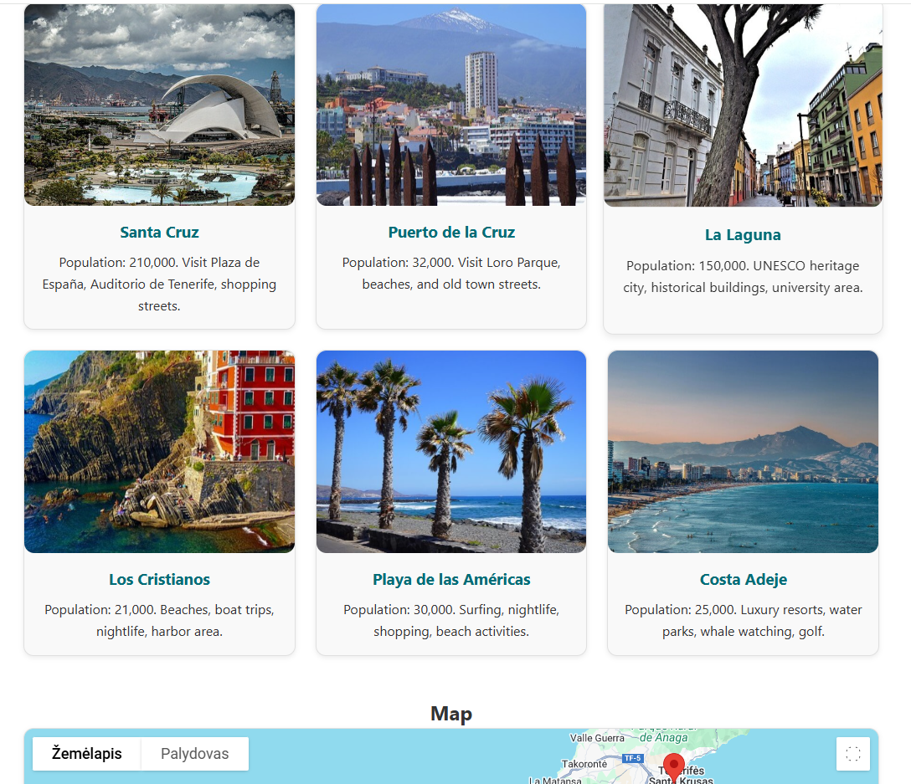

# Tenerife Holiday Locations
(Developer: Robertas Sladkevicius)

[Live Webpage](https://robertas-cyberattack.github.io/tenerife-holiday-locations/)

## Table of Contents
1. [Project Goals](#project-goals)
    1. [User Goals](#user-goals)
    2. [Site Owner Goals](#site-owner-goals)
    3. [Project Requirements & How They Are Implemented](#project-requirements-how-they-are-implemented)
2. [User Experience](#user-experience)
    1. [Target Audience](#target-audience)
    2. [User Requirements and Expectations](#user-requirements-and-expectations)
    3. [User Stories](#user-stories)
3. [Design](#design)
    1. [Design Choices](#design-choices)
    2. [Colours](#colours)
    3. [Fonts](#fonts)
    4. [Structure](#structure)
    5. [Wireframes](#wireframes)
4. [Technologies Used](#technologies-used)
    1. [Languages](#languages)
    2. [Frameworks & Tools](#frameworks--tools)
5. [Features](#features)
6. [Testing](#testing)
    1. [Tesiting Principles](#Tesiting-Principles)
    2. [Design and Implement Testing Procedures](#Design-and-Implement)
    3. [HTML Validation](#html-validation)
    4. [CSS Validation](#css-validation)
    5. [JavaScript Validation](#javascript-validation)
    6. [Accessibility](#accessibility)
    7. [Performance](#performance)
    8. [Device Testing](#device-testing)
    9. [Browser Compatibility](#browser-compatibility)
    10. [Testing User Stories](#testing-user-stories)
    11. [Test Procedures During Development and Implementation Stages](#Test-Procedures-During-Development)
    12. [Results of Manual Testing Procedures](#Results-of-Manual-Testing-Procedures)

7. [Bugs](#bugs)
8. [Deployment](#deployment)
9. [Credits](#credits)
10. [Acknowledgements](#acknowledgements)

---

## 1. Project Goals

**Tenerife Holiday Locations** is an interactive web application designed to help tourists discover key destinations in Tenerife using a responsive interface, an interactive map, and intuitive search features.

### 1.1 User Goals

- Easily explore Tenerife’s most popular locations.
- Interact with a live map to view markers, images, and descriptions.
- Navigate smoothly across all devices.
- Receive meaningful feedback from searches and form submissions.

### 1.2 Site Owner Goals

- Provide a valuable, visually engaging tourist resource.
- Demonstrate strong front-end skills in HTML, CSS, and JavaScript.
- Incorporate accessibility, usability, and clean UI principles.
- Deliver clear documentation, testing, and validation.

### 1.3 Project Requirements and How They Are Implemented

This project was built according to a defined set of functional and technical requirements.  
Each requirement is described below along with how it is implemented in the final website.

### Functional Requirements

### 1.3.1. Display a List of Locations

**Requirement:**  
Show multiple Tenerife locations with images, descriptions, and population information.

**Implementation:**  
- Six fully styled location cards displayed in a responsive grid.  
- Each card includes an image, name, population, and key highlights.  
- Cards are keyboard-focusable (`tabindex="0"`).

### 1.3.2. Interactive Map Integration

**Requirement:**  
Provide an interactive Google Map showing each location with markers.

**Implementation:**  
- Google Maps API loads dynamically when the user reaches the Map section.  
- Markers are created using HTML `data-*` attributes.  
- Clicking a marker: opens an info window, recenters the map, zooms in.  
- Clicking a location card triggers the same behaviour.

### 1.3.3. Search Functionality

**Requirement:**  
Users must be able to search for a location by name.

**Implementation:**  
- Search input filters cards dynamically.  
- Supports partial matching (e.g., "cru" → Santa Cruz).  
- User feedback via `aria-live`.  
- Reset button restores all locations and resets the map.

### 1.3.4. Contact Form With Validation

**Requirement:**  
Provide a contact form with validation and user feedback.

**Implementation:**  
- Required fields: name, email, message.  
- Regex email validation.  
- Errors communicated through `aria-live`.  
- On success:  
  - Message saved in `localStorage`  
  - Form resets  
  - Success message displayed

### 1.3.5. Accessibility Requirements

**Requirement:**  
Website must meet accessibility standards.

**Implementation:**  
- Semantic heading hierarchy.  
- ARIA labels for nav and live regions.  
- Keyboard-accessible cards and map controls.  
- High contrast colours + visible focus outlines.  
- Lighthouse accessibility score: **100**.

### 1.3.6. Responsive Web Design

**Requirement:**  
The website must work across all screen sizes.

**Implementation:**  
- CSS Grid + Flexbox layout.  
- Breakpoints at 768px and 480px.  
- Mobile adjustments include:  
  - Reduced map height  
  - Scaled typography  
  - Adaptive gallery grid  
- Tested across desktop, tablet, and mobile.

### 1.3.7. Error Handling

**Requirement:**  
App must gracefully handle failures.

**Implementation:**  
- Fallback message if Google Maps fails to load.  
- Clear error messages for search and form validation.

### 1.3.8. 404 Page

**Requirement:**  
Provide a user-friendly 404 page.

**Implementation:**  
- Custom GitHub Pages 404.  
- Includes a link back to the homepage.

---

## 2. User Experience

### 2.1 Target Audience

- Tourists planning to visit Tenerife.
- Casual users wanting a simple visual exploration tool.
- Users with accessibility needs or mobile devices.

### 2.2 User Requirements and Expectations

Users expect:

- Fast loading and simple navigation.
- Accurate search functionality with clear results.
- Map markers that reveal relevant information.
- Accessible design with keyboard navigation and alt text.
- A functional and validated contact form.

### 2.3 User Stories

As a user, I want to:

- Explore Tenerife on a map with helpful markers.
- Search locations to find specific information quickly.
- See images, descriptions, and population details.
- Submit a form with validation to ensure my message is correct.
- Use the site easily on mobile and desktop.

---

## 3. Design

### 3.1 Design Choices

- Clean, minimal UI supporting intuitive navigation.
- Clear section hierarchy with consistent spacing.
- Accessible colour contrasts and ARIA labels.
- Responsive page structure across all viewports.

### 3.2 Colours

The overall design focuses on being clean, calm, and easy to scan, reflecting the feel of a modern travel website:

- A **simple, card-based layout** presents each location with an image and short description, making it easy to browse and compare destinations.
- A clear **information hierarchy** is created using headings (`h1`, `h2`, `h3`), spacing, and consistent card structure so users can quickly understand each section.
- **Visual emphasis** is given to interactive elements such as buttons, navigation links, and location cards using colour, hover states, and box shadows.
- The layout is **responsive by design**, using Flexbox and CSS Grid (e.g. the `.gallery` grid and `.main-layout` flex column) to adapt to different screen sizes.
- **Accessibility and clarity** are supported through good contrast, focus outlines, ARIA labels on navigation and live regions, and keyboard-focusable location cards (`tabindex="0"`).

### 3.3 Fonts

The colour palette is defined using CSS custom properties in the `:root` selector, making it easy to maintain and extend:

css
:root {
  --bg: #ffffff;
  --primary: #006d77;
  --secondary: #83c5be;
  --accent: #ffb703;
  --text: #333;
  --muted: #777;
  --border: #e0e0e0;
  --shadow: rgba(0, 0, 0, 0.08);
}

### 3.4 Structure

The site uses a simple, intuitive structure that guides the user from introduction to interaction:

- A header with navigation elements.
- An introductory section explaining the site's purpose.
- An interactive map with markers for each Tenerife location.
- A locations list containing descriptions and images.
- A search bar that filters results dynamically.
- A contact form with validation and user feedback.
- A footer with supporting information.

This structure prioritises ease of use, accessibility, and clean information flow.

### 3.5 Wireframes

- Wireframe produced in Balsamiq.
  
- Stored in `/docs/design/`.
- Final site accurately follows the intended structure.

---

## 4. Technologies Used

### 4.1 Languages

- HTML5
- CSS3
- JavaScript

### 4.2 Frameworks & Tools

- Google Maps API
- W3C Validators (HTML & CSS)
- JSHint
- Balsamiq for wireframes
- Git & GitHub for version control and deployment
- Chrome Lighthouse for performance testing

---

## 5. Features

- Fully responsive layout.
- Interactive Google Map with custom markers.
- Dynamic search bar with instant filtering.
- Contact form with validation and `localStorage` integration.
- Accessible design (keyboard navigation, ARIA labels, alt text).
- 404 error page redirecting users back to the site.
- User feedback messages for errors, searches, and form submissions.

---

## 6. Testing

### 6.1 Testing Principles (Automated and Manual Testing)

Automated and manual testing are two complementary approaches used to ensure that the website performs correctly, meets user expectations, and complies with technical standards.

---

#### Manual Testing

**Principles:**
- Manual testing is carried out by a human interacting with the website as an end user.
- It focuses on verifying **functionality, usability, layout, responsiveness, and user experience**.
- Testers follow predefined test cases and document whether the expected behaviour occurs.
- It relies on observation and human judgement to identify visual or behavioural issues that automated tools may miss.

**When Manual Testing Is Used:**
- When testing **new or experimental features** that do not yet have automated tests.
- For **UI/UX testing**, including design consistency, layout alignment, and visual behaviour.
- When evaluating **responsiveness** across devices (mobile/tablet/desktop).
- For **accessibility behaviour**, such as keyboard navigation (e.g., using `tabindex="0"`) and screen readers.
- For **exploratory testing**, where testers try to find unexpected behaviours.

---

#### Automated Testing

**Principles:**
- Automated testing uses tools or scripts to run checks without human interaction.
- It is ideal for **repeatable, consistent, and large-scale testing**.
- Automated tools analyse code quality, performance, and standards compliance.
- Results are objective, fast, and reliable.

**When Automated Testing Is Used:**
- For **HTML, CSS, and JavaScript validation**, using:
  - W3C HTML Validator  
  - W3C CSS Validator  
  - JSHint for JavaScript
- For **regression testing**, ensuring updates do not break existing features.
- For **performance and accessibility audits**, e.g., Chrome Lighthouse.
- During **continuous development or deployment**, where repeated tests save time.

---

#### Summary

| Testing Type       | Best Used For |
|--------------------|------------------------------|
| **Manual Testing** | UI/UX checks, visual layout, responsiveness, accessibility behaviour, new features, exploratory testing |
| **Automated Testing** | Code validation, repetitive tasks, performance scoring, regression testing, CI/CD workflows |

Both methods are essential: automated testing ensures technical correctness, while manual testing ensures real-world usability and user experience.

### 6.2 Design and Implement Testing Procedures

To ensure the web application performs correctly, is easy to use, and behaves consistently across devices, a combination of **manual** and **automated** testing procedures was designed and implemented. Each type of testing targets a different aspect of the system and together provides full coverage of the site’s functionality, usability, and responsiveness.

---

#### **Functional Testing Procedures**

Functional testing focused on ensuring each feature behaved as expected.  
Test cases were created based on user stories and core features of the site.

**Testing Steps Included:**
- Searching for valid and invalid location names.
- Resetting the search results and verifying all locations reappear.
- Clicking each location card to check if:
  - The corresponding Google Map marker is focused.
  - The InfoWindow opens correctly.
  - The map zoom changes to the correct level.
- Testing keyboard interaction by pressing `Enter` on `.location` cards.
- Submitting the contact form with:
  - Empty inputs  
  - Invalid emails  
  - Valid data  
  and confirming correct feedback messages.
- Checking that saved messages appear correctly in `localStorage`.

These tests were conducted manually because they rely on user interaction, visual confirmation, and behavioural observation.

---

#### **Usability Testing Procedures**

Usability testing ensured the site feels clear, intuitive, and accessible.

**Testing Procedures:**
- Verifying navigation links scroll to the correct sections.
- Ensuring text labels, buttons, and images are readable and easy to understand.
- Checking hover effects and transitions help guide user attention.
- Testing keyboard accessibility:
  - Tabbing through links and interactive elements.
  - Confirming visible focus indicators (`:focus-visible` outlines).
  - Ensuring Enter key activates location cards.
- Evaluating form behaviour for clarity, error feedback, and user flow.
- Asking external users to interact with the site and provide feedback on clarity and ease of use.

Usability testing was performed manually because it requires human feedback and human judgement.

---

#### **Responsiveness Testing Procedures**

Responsiveness tests ensured the layout adapts correctly to different screen sizes.

**Testing Steps:**
- Using browser developer tools to simulate:
  - Mobile (360px wide)
  - Tablet (768px)
  - Desktop (1024px+)
- Checking that:
  - The header layout remains readable.
  - The search bar wraps cleanly on smaller screens.
  - The location grid (`.gallery`) adjusts the number of columns based on available space.
  - Text remains legible and requires no zooming.
  - Buttons remain accessible and tap-friendly on mobile.
  - The map resizes smoothly to `300px` height on smaller screens (as defined in the CSS).

Manual testing was used here because responsive design depends on visual judgment and interface feel.

---

#### **Automated Testing Procedures**

Automated tools were used to validate code quality, accessibility, and performance.

**Tools Used:**
- **W3C HTML Validator** – checked for HTML syntax issues.
- **W3C CSS Validator** – checked for CSS errors and warnings.
- **JSLint** – validated JavaScript structure and identified non-critical warnings.
- **Chrome Lighthouse** – tested:
  - Performance
  - Accessibility
  - Best practices
  - SEO

**Purpose of automated testing:**
- Ensure the application meets web standards.
- Detect structural or semantic errors early.
- Confirm consistent performance across devices.
- Validate accessibility scores objectively.

---

#### **Summary of Testing Approach**

| Testing Type | Purpose | Method |
|--------------|---------|--------|
| **Functional Testing** | Feature behaviour | Manual |
| **Usability Testing** | Ease of use & clarity | Manual |
| **Responsiveness Testing** | Mobile/tablet/desktop behaviour | Manual |
| **Code Validation** | Standards compliance | Automated |
| **Performance & Accessibility** | Speed, structure, WCAG compliance | Automated |

The combined testing approach ensured the site works reliably, feels intuitive, and remains visually consistent across all devices and browsers.

### 6.3 HTML Validation

- Tested using W3C Nu HTML Checker.
  
- 0 errors, only minor warnings.
- Screenshots located in `/docs/testing/`.

### 6.4 CSS Validation

- Tested using W3C CSS Validator.

- 0 errors, minor warnings for custom properties.

### 6.5 JavaScript Validation

- JSHint used for validation.
 
- No major issues.
- Two warnings: Functions declared withing loops referencing an outer scoped variable may lead to confusing semantics (map).

### 6.6 Accessibility

- Lighthouse Accessibility Score: 100.
  
- Includes proper ARIA roles, alt text, and keyboard navigation.

### 6.7 Performance

- Lighthouse Performance Score: 72.
  
- Performace live metrics
  
- Optimised images and clean JavaScript logic.

  
### 6.8 Device Testing

Successfully tested on:

- Desktop (Windows & macOS)
- Mobile (iPhone, Samsung)
- Tablet devices

### 6.9 Browser Compatibility

Tested on:

- Chrome
- Firefox
- Safari
- Edge

### 6.10 Testing User Stories

- All user stories were tested and passed successfully.
  
  - Extra Large Screen:
   

  - Large Screen:
   

  - Medium Screen:
   

  - Small Screen:
   
- Full test documentation is stored in `/docs/testing/`.

---

### 6.11 Test Procedures During Development and Implementation Stages

Throughout the development cycle, testing was applied continuously to ensure each new feature worked as intended before moving on to the next stage. This approach reduced errors, improved usability, and ensured that the final deployed version matched the behaviour of the development build.

---

#### **Testing During Development**

Testing was integrated into daily development tasks and applied immediately after implementing each feature. This included:

- **Component-level checks**  
  After creating individual elements (e.g., search bar, location cards, map container), visual and functional checks were performed to confirm structure, spacing, and correct rendering in the browser.

- **Interactive feature testing**  
  When adding JavaScript functionality—such as search filtering, map marker behaviour, or form validation—each function was tested manually in the browser before continuing development.

- **Console log monitoring**  
  The browser console was monitored regularly to identify JavaScript errors, warnings, or unintended behaviours during development.

- **Responsive behaviour checks**  
  Breakpoints were tested using Chrome DevTools each time a layout component was added or updated, ensuring elements resized correctly.

This iterative testing process ensured that issues were caught early, reducing rework later.

---

#### **Testing During Implementation**

When the full site structure was assembled, a more formal round of testing began. This included:

- **End-to-end feature testing**  
  Testing the entire workflow from landing on the site → browsing locations → searching → interacting with the map → submitting the contact form.

- **Cross-browser testing**  
  The site was tested in Chrome, Firefox, Edge, and Safari to ensure identical behaviour.

- **Device testing**  
  Real devices (iPhone, Samsung, iPad, desktop monitors) were used to confirm consistent usability and responsiveness.

- **Accessibility checks**  
  Keyboard navigation, ARIA labels, alt text, focus states, and screen-reader-friendly attributes were manually verified.

- **Code validation**  
  HTML, CSS, and JavaScript were validated using W3C and JSLint to ensure structural correctness.

---

#### **Ensuring the Deployed Version Matches the Development Version**

Once development testing was complete, the website was deployed using GitHub Pages. Additional checks were carried out to ensure the deployed site behaved exactly the same as the local development version.

These checks included:

- **Re-testing all functional features**  
  - Search bar behaviour  
  - Reset button  
  - Map marker interactions  
  - InfoWindow opening  
  - Contact form validation and `localStorage` saving  

- **Checking for deployment errors**  
  - Ensuring that all file paths loaded correctly (important on GitHub Pages due to case sensitivity).  
  - Verifying that images, CSS, and JavaScript files were referenced correctly.  
  - Confirming that the Google Maps API loaded without errors.

- **404 page verification**  
  Ensuring that broken links correctly redirected to `404.html`.

- **Lighthouse testing on the live site**  
  Running accessibility, performance, SEO, and best-practice audits to confirm they matched the results from the development build.

- **Visual comparison**  
  The deployed site was visually compared to the local version to ensure:
  - Colours  
  - Spacing  
  - Layout  
  - Images  
  - Typography  
  all matched exactly.

---

#### **Outcome**

Testing during both the **development** and **implementation** stages ensured that the final deployment was stable, accessible, and functionally identical to the local version.  
No differences were detected between the development build and the deployed site on GitHub Pages, confirming a successful deployment process.

### 6.12 Results of Manual Testing Procedures

A full round of structured manual testing was carried out to assess the website’s functionality, usability, and responsiveness. Each test case was planned in advance, executed on multiple devices and browsers, and the outcomes recorded to confirm whether the website met its design and performance requirements.

---

#### **Functionality Testing Results**

Manual functional tests focused on verifying core interactive features such as the search system, map behaviour, location cards, and the contact form.

| Feature Tested | Test Procedure | Expected Result | Actual Result | Pass |
|----------------|----------------|-----------------|---------------|:---:|
| Search bar – valid input | Enter “Santa Cruz” and submit | Only Santa Cruz card remains visible | Displayed correct filtered result | ✅ |
| Search bar – invalid input | Enter “xyz” | Show “No results found” message and hide cards | Correct error message shown, cards hidden | ✅ |
| Search reset | Click “Reset” button | All location cards reappear | All cards restored | ✅ |
| Location card click | Click each card | Map zooms in and marker opens InfoWindow | All cards triggered correct map behaviour | ✅ |
| Keyboard selection | Press Enter on focused card | Same behaviour as mouse click | Correct map interaction triggered | ✅ |
| Contact form – empty inputs | Submit with no data | Show “Please complete all fields” | Correct error displayed | ✅ |
| Contact form – invalid email | Enter wrong email format | Display “Please enter a valid email” | Correct validation message shown | ✅ |
| Contact form – valid entry | Enter full valid data | Show success message and save to localStorage | Data saved and message shown | ✅ |

---

#### **Usability Testing Results**

Usability tests examined clarity, navigation flow, accessibility, and visual consistency.

| Area | Test Procedure | Expected Behaviour | Result | Pass |
|------|----------------|--------------------|--------|:---:|
| Navigation links | Click “Locations”, “Map”, “Contact” | Smooth scroll to correct section | All links scrolled correctly | ✅ |
| Visual readability | Review headings, spacing, colours | Content should be readable and visually balanced | Layout clean and consistent | ✅ |
| Keyboard navigation | Navigate using Tab key | All interactive elements reachable; visible focus states | Focus outlines visible; full navigation supported | ✅ |
| ARIA labels | Inspect navigation and feedback components | ARIA labels provide clarity to assistive tech | All labels correctly applied | ✅ |
| Alt text | Inspect images | Descriptive alt text on all images | All images contain meaningful alt text | ✅ |
| Button interaction | Hover and click buttons | Smooth transitions and clear feedback | All interactions smooth and responsive | ✅ |

---

#### **Responsiveness Testing Results**

The website was tested on mobile, tablet, and desktop dimensions using both real devices and Chrome DevTools.

| Device / Screen Size | Test Procedure | Expected Behaviour | Result | Pass |
|----------------------|----------------|--------------------|--------|:---:|
| Mobile (360px width) | Inspect layout and navigation | Gallery adapts to 1–2 columns, text readable | Layout adjusted correctly | ✅ |
| Tablet (768px) | Inspect map, cards, and text | Balanced spacing, gallery adjusts to medium columns | Behaved as expected | ✅ |
| Desktop (1080px+) | Full layout review | Multi-column gallery, full-width map, centred content | Displayed correctly | ✅ |
| Map responsiveness | Resize browser window | Map scales without distortion | Map resized smoothly | ✅ |
| Buttons & inputs | Test tap/click on mobile | Controls remain touch-friendly | All buttons accessible | ✅ |

---

#### **Summary of Manual Testing**

All planned manual tests were executed successfully.  
The results confirm that the website:

- Functions correctly across all features  
- Provides a clear and intuitive user experience  
- Meets accessibility expectations  
- Responds reliably across devices and screen sizes  

## 7. Bugs

### Fixed

- Search results not resetting correctly.
- Missing keyboard accessibility for markers.
- Minor JSLint styling warnings.

### Unresolved

- None — all tests passed successfully.

---

## 8. Deployment

### Deployment Method

The project is hosted using GitHub Pages.

### Steps

1. Commit all changes to the `main` branch.
2. Push to GitHub.
3. Go to **Settings → Pages**.
4. Set source to the `main` branch.
5. Save and view the live URL:  
   <https://Robertas-Cyberattack.github.io/tenerife-holiday-locations/>

### Post-deployment checks

- No console errors.
- Fully responsive.
- Google Maps API loads correctly.
- 404 redirect confirmed.

---

## 9. Credits

- Google Maps API Documentation.
- W3C HTML & CSS Validators.
- JSHint.
- Development by **Robertas-Cyberattack**.
- Photos from iStockPhoto.com
  
---

## 10. Acknowledgement

- My wife, Rutai, for allowing me time to work on this project.
- Tutor Manuel Perez Romero — for his patience and guidance.
- All coding community members for helping and answering questions.
